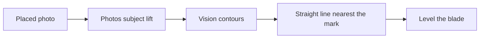

# Detecting the bottom of the blade

The shoulder mark is on the left. The blade runs to the right, and the cuts face up. The mark is close to the bottom edge, but that edge may sit a little above or below it, and the blade may be a few degrees off horizontal.

Step 1 of analysis finds that edge and uses its angle to level the blade. Later steps measure cut depths from this line.

## Where the work runs

Edge detection uses Core Image and Vision in the app (`KeyCutAnalyzer/BottomEdgeDetector.swift`). Choosing the line is Foundation-only (`Sources/KeyCutCore/BladeBottom.swift`), so it can be tested without a photo.

## 1. Subject lift

The Photos sticker uses `GenerateForegroundInstanceMaskRequest`. The same request isolates the key. The instance at the shoulder is kept; a second probe just up and to the right covers a mark that sits on the edge itself. Other foreground objects are left out. `generateMask` produces a solid silhouette. Reflections on the brass are gone because they are not a separate object.

Debug step 1 draws that silhouette in green on the placed photo. Later steps measure the blade from its outline.

If that mask is empty, the detector falls back to a grayscale image with highlights capped at 0.40, then `CICannyEdgeDetector`.

## 2. Contours

`VNDetectContoursRequest` traces the mask. It looks for a light shape on a dark field (`detectsDarkOnLight = false`). If that returns nothing, it tries the other polarity. The long side of the request matches the mask, so the outline is not shrunk.

Every contour is kept, including child contours. The bottom of the blade is the outline of the key, where the metal meets the background. Vision’s normalized points use a bottom-left origin; they are flipped to the photo’s top-left pixels. Chains that never reach the shoulder are dropped.

## 3. Straight pieces

A contour is split where its direction changes by more than 25°. That separates a straight bottom from the cuts and from the tip curve. A line Vision stored as only two endpoints is still a valid piece.

Each piece to the right of the shoulder is fit with least squares:

- **Angle** is the slope in degrees. Image Y grows downward, so a positive angle means the tip sits lower in the photo than the shoulder.
- **Offset** is the average perpendicular distance from the crosshair to that line, in pixels. Positive means the edge is above the mark, toward the cuts.
- **Span** is how far the piece runs along the line.
- **Residual** is the root-mean-square distance of the points from the line.

Pieces shorter than 80 pixels are discarded. They are not drawn, and they are not joined to anything else.

Pieces within 2.5° and 8 pixels of offset are joined and fit again. A strong edge that Canny split can become one line. The cut outline does not join the bottom, because it is not on the same line.

## 4. The chosen edge

A joined line is straight when all of these hold:

- angle within ±8° of horizontal
- span of at least 80 pixels
- residual of at most 4 pixels

Among the straight lines, only those at least 70% as long as the longest are kept. A line more than 24 pixels above the crosshair is the reflection on the blade face and is dropped. A line more than 48 pixels below the crosshair is background and is dropped. Inside that band, the same distance above the mark costs three times the same distance below it, so the lower outline wins. A long wavy cut loses on residual. A short speck loses on span.

Step 1 draws every surviving piece in brass and the chosen edge in green. The console lines prefixed with `[KeyCut] bottom` list each candidate’s angle, offset, residual, and span, then the winner.

## 5. Leveling

The chosen angle is the tilt of the bottom. Depths are measured from that line, not from the crosshair, so a mark that sits a few pixels off the edge does not shift every cut. The photo on screen is left where the user placed it. The correction is drawn on top of it.
